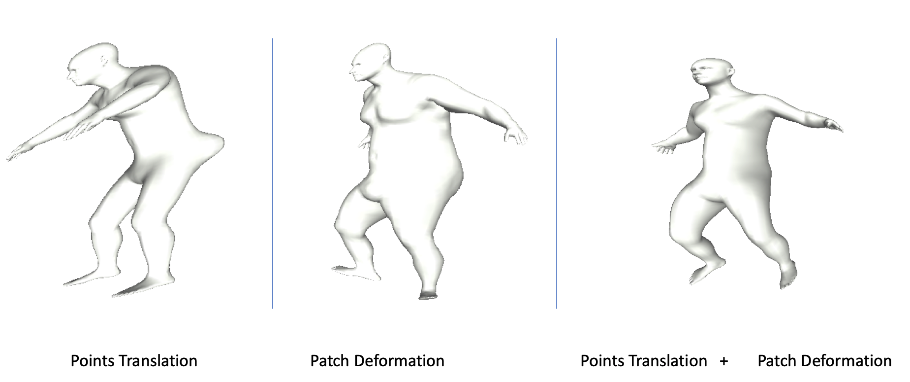
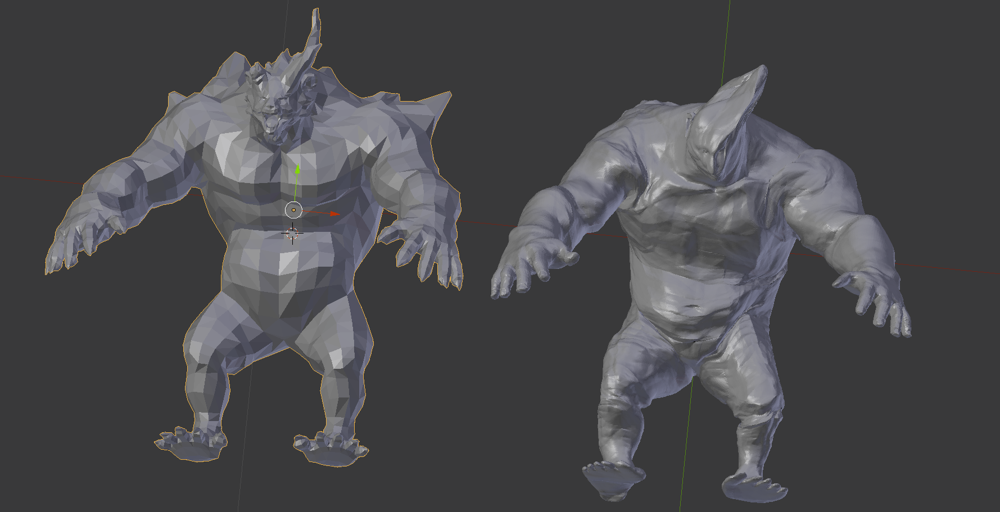

# **3D-CODED** [[Project Page]](http://imagine.enpc.fr/~groueixt/3D-CODED/index.html) [[Paper]](https://arxiv.org/abs/1806.05228) [[Talk]](http://imagine.enpc.fr/~groueixt/3D-CODED/ECCV_6Dpose_Workshop_Groueix.pptx) + **Learning Elementary Structure** [[Project Page]](http://imagine.enpc.fr/~deprellt/atlasnet2/) [[Paper]](https://arxiv.org/abs/1908.04725) [[Code]](https://github.com/TheoDEPRELLE/AtlasNetV2)


 **3D-CODED : 3D Correspondences by Deep Deformation** <br>Thibault Groueix,  Matthew Fisher, Vladimir G. Kim , Bryan C. Russell, Mathieu Aubry  <br>
In [ECCV, 2018](http://openaccess.thecvf.com/ECCV2018.py).

 **Learning elementary structures for 3D shape generation and matching** <br>Theo Deprelle, Thibault Groueix,  Matthew Fisher, Vladimir G. Kim , Bryan C. Russell, Mathieu Aubry  <br>
In [Neurips, 2019](https://neurips.cc/Register2?showPanel=2).

<details open><summary>Learned templates</summary>




<details><summary>Faust results</summary>


| Method                                               | L2 Train SURREAL | L2 Val SURREAL | Faust Intra results | Faust Inter results |
| ---------------------------------------------------- | --------------- |  --------------- | ------------------- | ------------------- |
| **3D-CODED**                                         | 1.098 | 1.315   | 1.747         |2.641               |
| **Points Translation**                              |9.980 | 1.263 | **1.626** | 2.714 |
| **Patch Deformation**                             | 1.028| 1.436      |1.742               | **2.578**    |
| **Points Translation + Patch Deformation**           |**0.969**| **1.173 ** |1.676              | 2.779       |


</details>


</details>

<details><summary>Sample results</summary>
Input : 2 meshes<br>
Task : put them in point-wise correspondence. (suggested by color)


</details>


## Install :construction_worker: [[Pytorch](http://pytorch.org/), Conda]

This implementation uses [Pytorch](http://pytorch.org/). 

```shell
git clone https://github.com/ThibaultGROUEIX/3D-CODED.git ## Download the repo
cd 3D-CODED; git submodule update --init
conda env create -f 3D-CODED-ENV.yml ## Create python env
source activate pytorch-3D-CODED
cd ./extension; python setup.py install; cd ..
pip install http://imagine.enpc.fr/~langloip/data/pymesh2-0.2.1-cp37-cp37m-linux_x86_64.whl
```


## Demo :train2:

```shell
python inference/correspondences.py --dir_name learning_elementary_structure_trained_models/1patch_deformation
```
This script takes as input 2 meshes from ```data``` and compute correspondences in ```results```. Reconstruction are saved in ```dir_name```.

<details><summary>Options  (Usually default parameters are good)</summary>


```python
# Key parameters
'--dir_name', type=str, default="",  help='dirname')
'--inputA', type=str, default =  "data/example_0.ply",  help='your path to mesh 0'
'--inputB', type=str, default =  "data/example_1.ply",  help='your path to mesh 1'

# Secondary parameters
'--HR', type=int, default=1, help='Use high Resolution template for better precision in the nearest neighbor step ?'
'--reg_num_steps', type=int, default=3000, help='number of epochs to train for during the regression step'
'--num_points', type=int, default = 6890,  help='number of points fed to poitnet'
'--num_angles', type=int, default = 100,  help='number of angle in the search of optimal reconstruction. Set to 1, if you mesh are already facing the cannonical 				direction as in data/example_1.ply'
'--env', type=str, default="CODED", help='visdom environment'
'--clean', type=int, default=0, help='if 1, remove points that dont belong to any edges'
'--scale', type=int, default=0, help='if 1, scale input mesh to have same volume as the template'
'--project_on_target', type=int, default=0, help='if 1, projects predicted correspondences point on target mesh'
'--randomize', type=int, default=0, help='if 1, projects predicted correspondences point on target mesh'
'--LR_input', type=int, default=1, help='Use Low Resolution Input '
```
</details>

<details><summary>Results  </summary>


* **Initial guesses** for *example0* and *example1*:


* **Final reconstruction** for *example0* and *example1*:


</details>

<details><summary>On your own meshes  </summary>

You need to make sure your meshes are preprocessed correctly :

* The meshes are loaded with **Trimesh**, which should support a bunch of formats, but I only tested ```.ply``` files. Good converters include [**Assimp**](https://github.com/assimp/assimp) and [Pymesh](https://github.com/qnzhou/PyMesh).


* The trunk axis is the **Y axis** (visualize your mesh against the mesh in ```data``` to make sure they are normalized in the same way). 
* the **scale** should be about 1.7 for a standing human (meaning the unit for the point cloud is the ```m```). You can automatically scale them with the flag ```--scale 1```


--> Failure modes instruction : :warning:

- Sometimes the reconstruction is flipped, which break the correspondences. In the easiest case where you meshes are registered in the same orientation, you can just fix this angle in ```reconstruct.py``` line 86, to avoid the flipping problem. Also note from this line that the angle search only looks in [-90°,+90°].

- Check the presence of lonely outliers that break the Pointnet encoder. You could try to remove them with the ```--clean``` flag.

</details>

<details><summary>FAUST </summary>

* If you want to use ```inference/correspondences.py``` to process a hole dataset, like FAUST test set, you can use ```./inference/script.py```, for the FAUST inter challenge. **Good luck :-)**

</details>


## Training


```shell
python ./training/train_sup.py
```

<details><summary> Trainer's Options</summary>

```python
'--point_translation', type=int, default=0, help='point_translation'
'--dim_template', type=int, default=3, help='dim_template'
'--patch_deformation', type=int, default=0, help='patch_deformation'
'--dim_out_patch', type=int, default=3, help='dim_out_patch'
'--start_from', type=str, default="TEMPLATE", choices=["TEMPLATE, SOUP, TRAINDATA"] ,help='dim_out_patch'
```
</details>

<details><summary> Monitor your training on http://localhost:8888/</summary>


</details>

<details><summary> Note on data preprocessing  </summary>


The generation process of the dataset is quite heavy so we provide our processed data. Should you want to reproduce the preprocessing, go to ```data/README.md```. Brace yourselve :-)

</details>


## Reproduce the paper :train2:

```shell
python script/launch.py --mode training #Launch 4 trainings with different parameters.
python script/launch.py --mode inference #Eval the 4 pre-trained models.
```


## Citing this work 

If you find this work useful in your research, please consider citing:


```
@inproceedings{deprelle2019learning,
  			title={Learning elementary structures for 3D shape generation and matching},
  			author={Deprelle, Theo and Groueix, Thibault and Fisher, Matthew and Kim, Vladimir G and Russell, Bryan C and Aubry, Mathieu},
  			booktitle={Neurips},
  			year={2019}
}
```

##  

```
@inproceedings{groueix2018b,
          title = {3D-CODED : 3D Correspondences by Deep Deformation},
          author={Groueix, Thibault and Fisher, Matthew and Kim, Vladimir G. and Russell, Bryan and Aubry, Mathieu},
          booktitle = {ECCV},
          year = 2018}
        }
```

## 

## License

[MIT](https://github.com/ThibaultGROUEIX/AtlasNet/blob/master/license_MIT)


## Cool Contributions

* **[Zhongshi Jiang](https://cs.nyu.edu/~zhongshi/)** applying trained model on a monster model :japanese_ogre: (**left**: original , **right:** reconstruction)



[](https://github.com/ThibaultGROUEIX/3D-CODED/)


## Acknowledgement

- The code for the Chamfer Loss was adapted from **[Fei Xia](http://fxia.me/)**'a repo : [PointGan](https://github.com/fxia22/pointGAN). Many thanks to him !
- The code for the Laplacian regularization comes from [**Angjoo** **Kanazawa**](https://people.eecs.berkeley.edu/~kanazawa/) and [**Shubham** **Tulsiani**](https://people.eecs.berkeley.edu/~shubhtuls/). This was so helpful, thanks !
- Part of the SMPL parameters used in the training data comes from [**Gül** **Varol**](https://www.di.ens.fr/~varol/)'s repo : https://github.com/gulvarol/surreal But most of all, thanks for all the advices :)
- The FAUST Team for their prompt reaction in resolving a benchmark issue the week of the deadline, especially to [**Federica** **Bogo**](https://ps.is.tuebingen.mpg.de/person/fbogo) and **Jonathan Williams**.
- The efficient code for to compute geodesic errors comes from  https://github.com/zorah/KernelMatching. Thanks!
- The [SMAL](http://smalr.is.tue.mpg.de/) team, and [SCAPE](https://ai.stanford.edu/~drago/Projects/scape/scape.html) team for their help in generating the training data.
- [DeepFunctional Maps](https://arxiv.org/abs/1704.08686) authors for their fast reply the week of the rebuttal ! Many thanks.
- **[Hiroharu Kato](http://hiroharu-kato.com/projects_en/neural_renderer.html)** for his very clean neural renderer code, that I used for the gifs :-)
- [Pytorch developpers](https://github.com/pytorch/pytorch) for making DL code so easy.
- This work was funded by [Ecole Doctorale MSTIC](http://www.univ-paris-est.fr/fr/-ecole-doctorale-mathematiques-et-stic-mstic-ed-532/). Thanks !
- And last but not least, my great co-authors : **[Theo Deprelle](http://imagine.enpc.fr/~deprellt/)**,  **[Matthew Fisher](http://graphics.stanford.edu/~mdfisher/publications.html), [Vladimir G. Kim](http://vovakim.com/), [Bryan C. Russell](http://bryanrussell.org/), and [Mathieu Aubry](http://imagine.enpc.fr/~aubrym/cv.html)**

